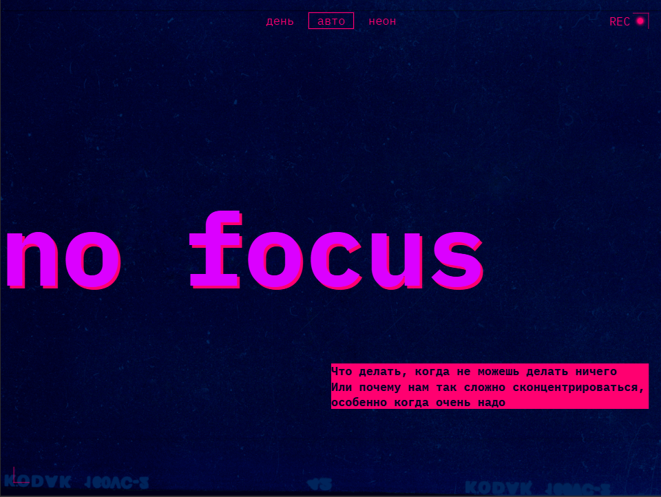
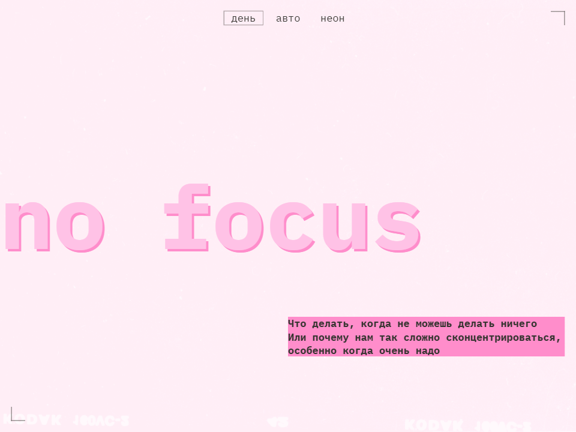
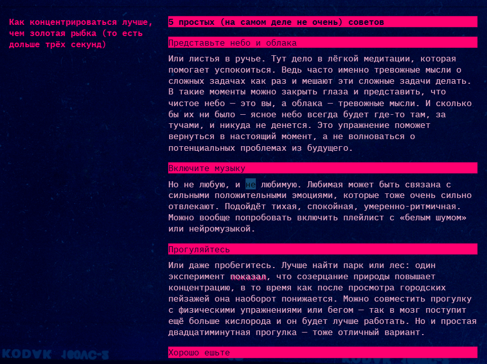
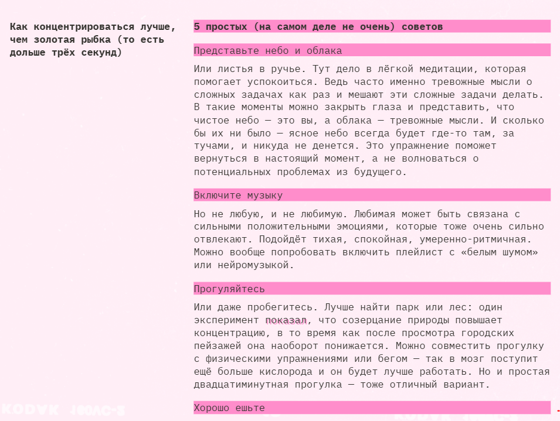
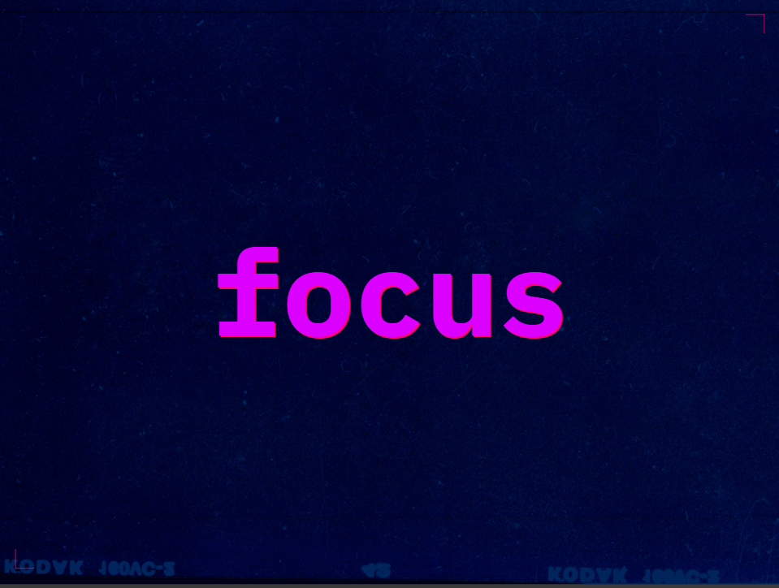
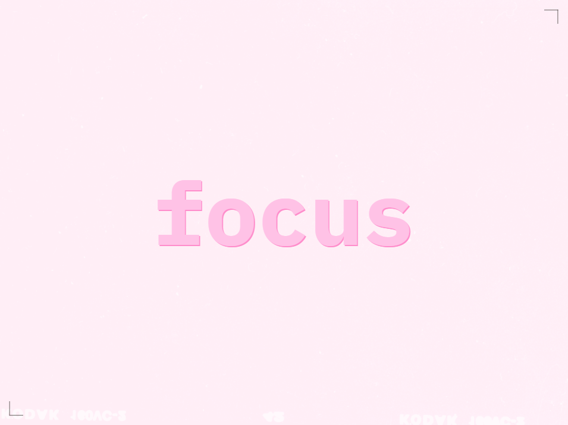

# Проект No focus 🤹🎯

[Ссылка на проект в GitHub](https://github.com/HelenVirtanen/slozhno-sosredotochitsya-fd)
[Посмотреть на GitHub Pages](https://helenvirtanen.github.io/slozhno-sosredotochitsya-fd/)

## 📖 Описание проекта: 
Проект "No focus" разработан с целью улучшения понимания факторов, влияющих на нашу концентрацию, и демонстрации способов её повышения. Он выполнен в интерактивной и познавательной форме. 

**💡 __Основная идея__** - рассказать о том, что мешает сосредоточиться и какие есть методы повышения концентрации.

### 🧩 Элементы интерфейса:
* __Навигационное меню__ для выбора темы оформления (день, авто, неон);
* __Заголовок и описание проекта__;
* __Список факторов__, снижающих концентрацию внимания, с пояснениями;
* __Список рекомендаций__ по улучшению концентрации;
*__Галерея__ для визуализации темы.

## 🖼️ Скриншоты

### 🌅 Интро
| Тёмная тема | Светлая тема |
|------------|--------------|
|  |  |

### 📄 Пример статьи
| Тёмная тема | Светлая тема |
|------------|--------------|
|  |  |

### 🖼️ Галерея
| Тёмная тема | Светлая тема |
|------------|--------------|
|  |  |

### 🎯 Закрывающая секция
| Тёмная тема | Светлая тема |
|------------|--------------|
|  |  |


### ⚙️ Что делает скрипт:
* При загрузке страницы настраивает автоматическую тему в зависимости от пользовательских предпочтений;
* Обрабатывает переключение темы, обеспечивая плавный переход между стилями оформления.

## 🛠️ Применяемые технологии
* HTML
* CSS (включая адаптивность, тёмную/светлую темы)
* JavaScript

## 🚀 Установка и запуск
**1. Клонировать репозиторий**
```bash
git clone https://github.com/HelenVirtanen/slozhno-sosredotochitsya-fd.git
```

**2. Запустить**
* Открыть проект в VS Code.
* Убедиться, что установлен плагин Live Server.
* Нажать "Go Live" в правом нижнем углу редактора.
